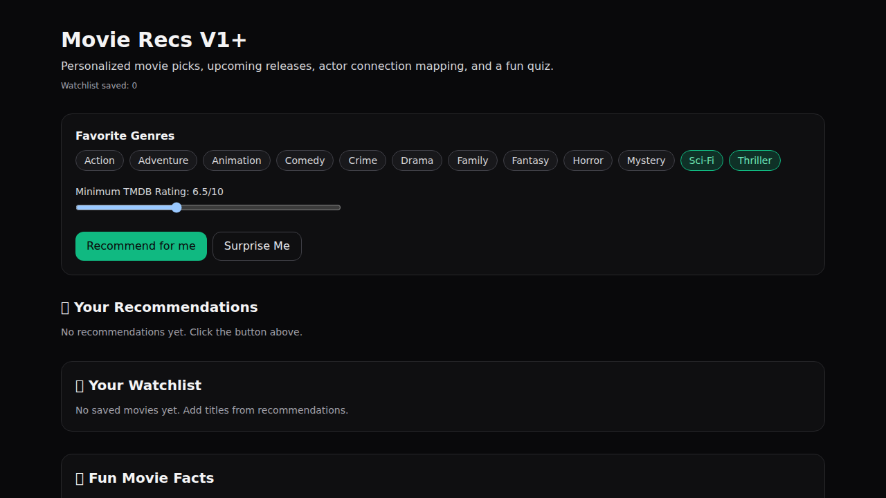

# Movie Recs V1

A V1 movie recommendation website built with Next.js.

## Frontend Preview


### Latest UI (V1+ Enhancements)



## What it does (V1+)

- Lets users choose favorite genres
- Lets users set a minimum TMDB rating threshold
- Fetches candidate and upcoming movies from TMDB
- Ranks recommendations with a simple explainable scoring model
- Shows "Why recommended" and top cast on each movie card
- Builds an actor connection graph (co-star relationships)
- Includes a fun facts panel and a movie knowledge quiz

## Stack

- Next.js (App Router)
- TypeScript
- Tailwind CSS
- TMDB API

## Setup

1. Install dependencies:

```bash
npm install
```

2. Copy env file:

```bash
cp .env.example .env.local
```

3. Add TMDB auth to `.env.local` (v4 read token preferred):

```bash
TMDB_API_READ_ACCESS_TOKEN=...
# or legacy key
TMDB_API_KEY=...
```

4. Run dev server:

```bash
npm run dev
```

Open `http://localhost:3000`.

## API Routes

- `GET /api/search?q=...` → movie search (TMDB)
- `POST /api/recommend` → recommendations + actor network metadata
- `POST /api/upcoming` → upcoming titles by preferred genres

`POST /api/recommend` body:

```json
{
  "favoriteGenres": [878, 53],
  "minVoteAverage": 6.5
}
```

## Notes on IMDb / Rotten Tomatoes

For production use, confirm licensing/usage terms before scraping or redistributing Rotten Tomatoes/IMDb data.
Recommended production-safe approach:

- TMDB for metadata/discovery/posters
- OMDb (licensed/API-based) for IMDb rating fields
- Optional provider partnerships for broader review text rights

## Recent Product Updates

- Added persistent local watchlist (saved in browser localStorage)
- Added “Surprise Me” taste button for quick discovery
- Added stale-filter indicator when settings change and refresh is needed
- Added upcoming movie discovery by preferred genres
- Added actor relationship mapping from recommendation cast overlap
- Added fun facts and interactive movie quiz sections
- Added updated frontend screenshot assets in `/public`

## Next Steps (V2)

- User auth + persistent profiles
- Like/dislike feedback loop
- Collaborative filtering
- Streaming provider availability
- Rich review sentiment scoring
