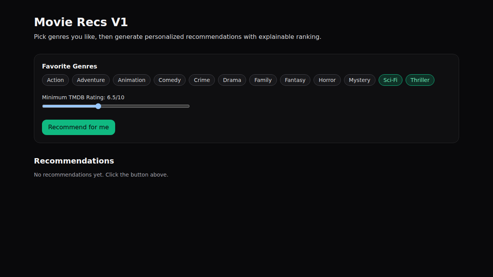

# Movie Recs V1

A V1 movie recommendation website built with Next.js.

## Frontend Preview



## What it does (V1)

- Lets users choose favorite genres
- Lets users set a minimum rating threshold
- Fetches candidate movies from TMDB
- Ranks recommendations with a simple explainable scoring model
- Shows a short "Why recommended" explanation per movie

## Stack

- Next.js (App Router)
- TypeScript
- Tailwind CSS
- TMDB API

## Setup

1. Install dependencies:

```bash
npm install
```

2. Copy env file:

```bash
cp .env.example .env.local
```

3. Add your TMDB key to `.env.local`:

```bash
TMDB_API_KEY=...
```

4. Run dev server:

```bash
npm run dev
```

Open `http://localhost:3000`.

## API Routes

- `GET /api/search?q=...` → movie search (TMDB)
- `POST /api/recommend` with body:

```json
{
  "favoriteGenres": [878, 53],
  "minVoteAverage": 6.5
}
```

## Notes on IMDb / Rotten Tomatoes

For production use, confirm licensing/usage terms before scraping or redistributing Rotten Tomatoes/IMDb data.
Recommended production-safe approach:

- TMDB for metadata/discovery/posters
- OMDb (licensed/API-based) for IMDb rating fields
- Optional provider partnerships for broader review text rights

## Next Steps (V2)

- User auth + persistent profiles
- Like/dislike feedback loop
- Collaborative filtering
- Streaming provider availability
- Rich review sentiment scoring
